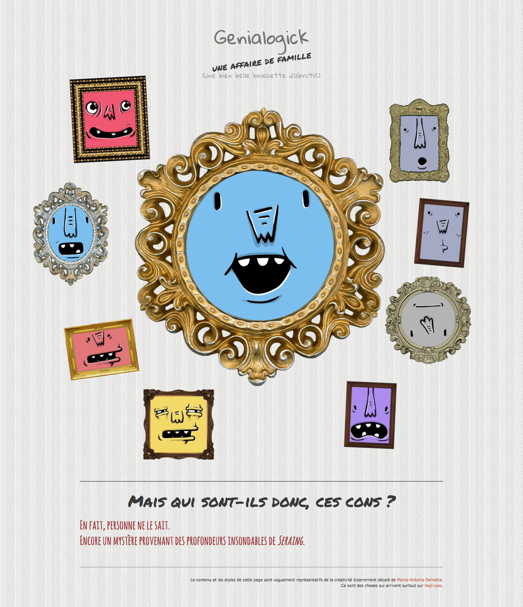

# CSS "Genialogik"

> CSS exercise given at HEPL

* * *

**CSS "Genialogik"** is an educational project, which will be used for `HTML`/`CSS` courses.

**Note:** the school where the course is given, the [HEPL](http://www.provincedeliege.be/hauteecole) from Liège, Belgium, is a french-speaking school. From this point, the instruction will be in french. Sorry.

* * *

> Lors de vos labos de *travaux dirigés*, vous allez découvrir le langage CSS et le mettre en pratique via de courts exercices de mise en situation.  
> Les labos de *travaux pratiques* vont vous confronter à des exercices pratiques et individuels reprenant la matière vue lors du TD précédent.

* * *

## Genialogik, une histoire de famille.

Vous trouverez dans ce dossier une page HTML nommée **index.html**. Cette page contient quelques images, une série de portraits que nous aimerions mettre en page de manière originale.

Le rendu final désiré est le suivant : .

Tous les styles ont déjà été écris, mais les sélecteurs ont disparus.  
Sur base des indications contenus dans la feuille de styles, rendez à la page le *look* désiré.

### Consignes

* Lier le fichier **styles.css** à la page **index.html**.
* Sur base des indications présentes dans la feuille de styles, ajoutez les sélecteurs pour chaque bloc.
* Bon travail et bon amusement&nbsp;!

* * *

### Références graphiques

* Les portraits proviennent de [adorable.io](http://avatars.adorable.io/).
* La texture du fond provient de [SubtlePatterns](http://subtlepatterns.com/subtle-stripes/).
* Les encadrements viennent d'un peu partout sans réellement avoir trouvé d'auteur.

Code original par [Pierre-Antoine Delnatte](https://github.com/leny).
